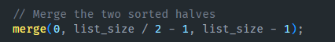

# Project 6 Report

110511010 楊育陞

## Part I

**Q: Explain how you implement your code clearly with screenshots of your functions.**

Step 1. After reading the list of data, I split the list into two halves and create two threads running function 'multi_thread_morge_sort' to sort them respectively. 

Step 2. When running 'multi_thread_morge_sort', I use merge sort algorithm to sort the list.

Step 3. Use 'pthread_join' to wait for the two threads to finish sorting.

Step 4. Merge the two sorted lists into one sorted list.

Step 5. Write the sorted list into the output file.

Following is the screenshot of merge & merge_sort function:
merge:

merge_sort:

## Part II

**Q1: Describe which lines of code you modify with detailed explanations.**

A1:
I mainly modify the function "calculate_innner_product" as following:

The original code add the result of multiplication of each element directly to global variable "inner_product".
I modify the code to add the result of multiplication of each element to local variable "temp_inner_product".
After finishing the loop, I lock the mutex and add "temp_inner_product" to "inner_product" then unlock the mutex.
I also add some code to initialize and destroy the mutex as following:
In global domain:

In main function:

**Q2:  After implementing modifications to the sample code in Part II, consider whether the multi-threaded version will outperform the serial version provided below. What factors contribute to the difference in performance?**

A2:
The multi-threaded version will outperform the serial version.
In this case, NUM_THREADS = 8, so the multi-threaded version will split the two vectors into 8 parts and calculate the inner product of each part respectively.
The multi-threaded version will add the results of each part to final result only after finishing the loop and get the mutex lock.
So the multi-threaded version will be 8 times faster than the serial version ideally (ignore overhead).